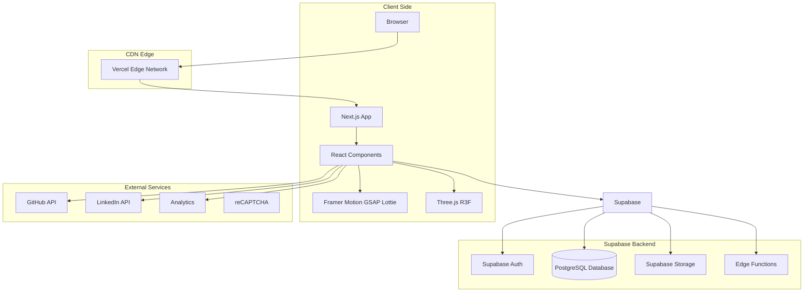
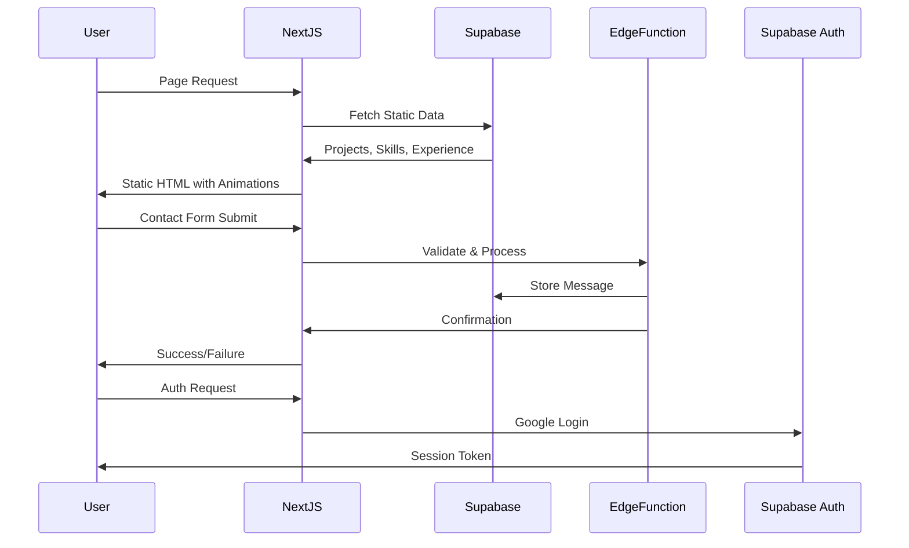
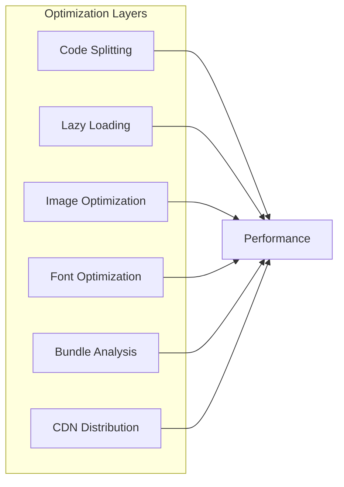
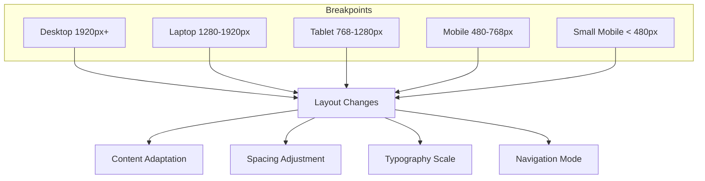

# Utkarsh Tripathi - Modern Portfolio

## Product Requirements Document (PRD)

**Version:** 1.0  
**Date:** February 2025  
**Author:** Utkarsh Tripathi  
**Status:** Draft

---

## Table of Contents

1. [Project Vision & Goals](#1-project-vision--goals)
2. [Tech Stack Decisions](#2-tech-stack-decisions)
3. [System Architecture](#3-system-architecture)
4. [Folder Structure](#4-folder-structure)
5. [UI/UX Design Principles](#5-uiux-design-principles)
6. [Data Models](#6-data-models)
7. [Feature Breakdown](#7-feature-breakdown)
8. [Implementation Roadmap](#8-implementation-roadmap)
9. [Future Scalability](#9-future-scalability)

---

## 1. Project Vision & Goals

### 1.1 Vision Statement

Create a modern, high-end developer portfolio that reflects industry-level frontend and full-stack practices. The portfolio should showcase technical expertise, creative problem-solving abilities, and professional growth while providing an exceptional user experience through polished UI/UX, smooth animations, and interactive components.

### 1.2 Primary Goals

- **Professional Presentation:** Present a polished, industry-ready image to potential employers, clients, and collaborators
- **Content Management:** Enable easy updates to projects, skills, and achievements without code changes
- **Performance:** Achieve excellent Core Web Vitals scores (95+ Lighthouse)
- **Accessibility:** WCAG 2.1 AA compliant for inclusive access
- **SEO:** Optimized for search engines to increase discoverability
- **Interactive Experience:** Delight users with smooth animations, micro-interactions, and optional 3D elements

### 1.3 Target Audience

- **Recruiters/HR:** Quick overview of skills, experience, and projects
- **Technical Leads/Developers:** Detailed project insights and code quality
- **Clients:** Professional services overview and contact information
- **Fellow Students/Peers:** Inspiration and collaboration opportunities
- **Open Source Community:** Contribution history and community involvement

### 1.4 Key Metrics for Success

- Page load time < 2 seconds
- Mobile responsiveness score 100%
- Contact form conversion rate > 5%
- Project detail page engagement > 60%
- Lighthouse Performance/Accessibility/Best Practices/SEO: 95+

---

## 2. Tech Stack Decisions

### 2.1 Frontend Stack

| Technology | Purpose | Justification |
|------------|---------|---------------|
| **Next.js 15 (App Router)** | Core Framework | Server-side rendering, static generation, automatic image optimization, built-in routing, excellent SEO, React Server Components for performance |
| **TypeScript** | Language | Type safety, better developer experience, easier refactoring, reduced runtime errors |
| **Tailwind CSS** | Styling | Utility-first, rapid development, small bundle size, easy theming, excellent performance |
| **shadcn/ui** | Component Library | Copy-paste architecture, fully customizable, Radix UI primitives, modern design, accessible |
| **Radix UI** | Headless Primitives | Accessible component primitives, headless design, full control over styling, keyboard navigation |
| **Framer Motion** | Core Animations | Declarative animations, smooth transitions, gesture support, layout animations, excellent performance |
| **GSAP** | Advanced Animations | Timeline-based animations, complex sequences, scroll-triggered animations, precise control |
| **Lenis Scroll** | Smooth Scrolling | Smooth scroll implementation, momentum-based, customizable, excellent performance |
| **Lottie** | Micro-animations | Lightweight vector animations, JSON-based, cross-platform, high quality at small file sizes |
| **Three.js / React Three Fiber** | 3D Elements | Selective 3D accents (particles, subtle 3D objects), WebGL rendering, React integration |
| **Zod** | Validation | Type-safe runtime validation, schema definition, TypeScript integration |
| **React Hook Form** | Form Management | Performance, easy validation integration, minimal re-renders |

### 2.2 Backend Stack

| Technology | Purpose | Justification |
|------------|---------|---------------|
| **Supabase** | Backend-as-a-Service | PostgreSQL database, authentication, storage, edge functions, real-time subscriptions, excellent developer experience |
| **PostgreSQL** | Primary Database | Relational data, robust querying, JSON support, excellent performance, Supabase native integration |
| **Supabase Auth** | Authentication | Google OAuth, email/password, secure, customizable, integrates seamlessly with frontend |
| **Supabase Storage** | Media Storage | Resume PDF, project images, profile pictures, CDN distribution, secure signed URLs |
| **Supabase Edge Functions** | Serverless Logic | Deno runtime, TypeScript support, scalable, secure environment variables |

### 2.3 Development Tools

| Technology | Purpose |
|------------|---------|
| **VS Code** | Primary IDE |
| **Git / GitHub** | Version control, CI/CD |
| **Husky** | Git hooks for quality checks |
| **ESLint** | Code linting |
| **Prettier** | Code formatting |
| **Knip** | Unused file/package detection |
| **bundle-analyzer** | Bundle size analysis |

### 2.4 Technology Justification Summary

**Why Next.js + App Router?**
- Hybrid rendering (SSR, SSG, ISR) for optimal performance
- Built-in image optimization reduces layout shift
- File-based routing simplifies project structure
- React Server Components reduce client-side JavaScript
- Excellent TypeScript support out of the box

**Why shadcn/ui over other component libraries?**
- Copy-paste architecture means no dependency lock-in
- Full ownership of code and styling
- Built on Radix UI for accessibility
- Regular updates and community contributions
- Tailwind-first design philosophy

**Why Supabase?**
- All-in-one backend solution
- Excellent free tier for personal projects
- PostgreSQL provides robust data management
- Authentication with minimal setup
- Storage integrates seamlessly with database
- Edge Functions for custom server logic

**Why this specific animation stack?**
- Framer Motion: Best React animation library, declarative, performance-optimized
- GSAP: Industry standard for complex animations, precise timeline control
- Lenis Scroll: Essential for modern scroll experiences, smooth momentum
- Three.js: Selective 3D accents without overwhelming the design

---

## 3. System Architecture

### 3.1 High-Level Architecture Diagram



### 3.2 Data Flow Diagram



### 3.3 Rendering Strategy

| Page/Section | Rendering Strategy | Reason |
|--------------|-------------------|--------|
| Hero Section | Static (SSG) + Client Hydration | Immediate LCP, animations need client |
| About Me | Static (SSG) | Rarely changes |
| Skills | Static (SSG) | Rarely changes |
| Experience | Static (SSG) | Rarely changes |
| Projects | ISR (1 hour) | Content updates periodically |
| Blog | ISR (1 hour) | Content updates periodically |
| Contact Form | Client-side | Interactive |
| Admin Dashboard | Client-side | Dynamic, authenticated |
| 3D Elements | Client-side | WebGL rendering |

### 3.4 Caching Strategy

- **Static Content:** Next.js built-in caching
- **Dynamic Content:** Supabase client with React Query
- **Images:** Next.js Image component with CDN
- **API Responses:** Unstable_cache for server data

### 3.5 Performance Architecture



---

## 4. Folder Structure

### 4.1 Project Root Structure

```
new-portfolio/
├── .github/
│   ├── workflows/
│   │   ├── ci.yml
│   │   └── deploy.yml
│   └── ISSUE_TEMPLATE/
├── apps/
│   ├── web/                 # Next.js application
│   └── admin/               # Admin dashboard (future)
├── packages/
│   ├── ui/                  # Shared UI components
│   ├── config/              # Shared configuration
│   ├── types/               # Shared TypeScript types
│   └── utils/               # Shared utilities
├── supabase/
│   ├── migrations/          # Database migrations
│   ├── seeders/             # Seed data
│   └── functions/           # Edge Functions
├── content/                 # MDX content (blog posts)
├── public/                  # Static assets
├── plans/                   # Planning documents
├── docs/                    # Documentation
├── .env.example
├── .eslintrc.json
├── .gitignore
├── .prettierrc
├── biome.json
├── next.config.ts
├── package.json
├── tailwind.config.ts
├── tsconfig.json
└── README.md
```

### 4.2 Next.js App Structure (apps/web)

```
apps/web/
├── public/
│   ├── images/
│   │   ├── projects/
│   │   ├── blog/
│   │   └── profile/
│   ├── fonts/
│   ├── icons/
│   └── robots.txt
├── src/
│   ├── app/
│   │   ├── (marketing)/    # Marketing pages
│   │   │   ├── layout.tsx
│   │   │   ├── page.tsx
│   │   │   ├── about/
│   │   │   │   └── page.tsx
│   │   │   ├── projects/
│   │   │   │   ├── page.tsx
│   │   │   │   └── [slug]/
│   │   │   │       └── page.tsx
│   │   │   ├── experience/
│   │   │   │   └── page.tsx
│   │   │   ├── contact/
│   │   │   │   └── page.tsx
│   │   │   └── resume/
│   │   │       └── page.tsx
│   │   ├── (admin)/        # Admin routes
│   │   ├── api/            # API routes
│   │   ├── globals.css
│   │   ├── layout.tsx
│   │   └── not-found.tsx
│   ├── components/
│   │   ├── ui/             # shadcn/ui components
│   │   ├── sections/       # Page sections
│   │   │   ├── Hero.tsx
│   │   │   ├── About.tsx
│   │   │   ├── Skills.tsx
│   │   │   ├── Experience.tsx
│   │   │   ├── Projects.tsx
│   │   │   ├── Contact.tsx
│   │   │   └── Footer.tsx
│   │   ├── animations/     # Animation components
│   │   │   ├── FramerWrapper.tsx
│   │   │   ├── GsapTimeline.tsx
│   │   │   ├── SmoothScroll.tsx
│   │   │   └── LottiePlayer.tsx
│   │   ├── canvas/         # Three.js components
│   │   │   ├── Particles.tsx
│   │   │   └── Scene3D.tsx
│   │   ├── layout/         # Layout components
│   │   │   ├── Navbar.tsx
│   │   │   ├── Sidebar.tsx
│   │   │   └── Header.tsx
│   │   ├── forms/          # Form components
│   │   │   ├── ContactForm.tsx
│   │   │   └── NewsletterForm.tsx
│   │   └── providers/      # Context providers
│   │       ├── ThemeProvider.tsx
│   │       └── AnimationProvider.tsx
│   ├── lib/
│   │   ├── supabase/       # Supabase client
│   │   │   ├── client.ts
│   │   │   ├── server.ts
│   │   │   └── types.ts
│   │   ├── hooks/          # Custom hooks
│   │   │   ├── useScroll.ts
│   │   │   ├── useIntersection.ts
│   │   │   └── useAnimation.ts
│   │   ├── utils/          # Utility functions
│   │   │   ├── cn.ts
│   │   │   └── format.ts
│   │   ├── constants/      # App constants
│   │   │   └── index.ts
│   │   └── validators/     # Zod validators
│   │       └── forms.ts
│   ├── styles/
│   │   ├── globals.css
│   │   └── animations.css
│   └── types/              # TypeScript types
│       └── index.ts
├── .env.local
├── next.config.js
├── tailwind.config.ts
├── postcss.config.js
├── tsconfig.json
└── package.json
```

### 4.3 Supabase Structure (supabase/)

```
supabase/
├── functions/
│   ├── _shared/
│   │   └── cors.ts
│   ├── contact-form/
│   │   └── index.ts
│   ├── newsletter/
│   │   └── index.ts
│   └── analytics/
│       └── index.ts
├── migrations/
│   ├── 2025_02_01_initial_schema.sql
│   ├── 2025_02_02_projects_table.sql
│   └── 2025_02_03_blog_posts_table.sql
├── config.toml
└── .gitignore
```

### 4.4 Package Structure (packages/)

```
packages/
├── ui/
│   ├── src/
│   │   ├── Button.tsx
│   │   ├── Card.tsx
│   │   ├── Input.tsx
│   │   ├── Badge.tsx
│   │   ├── Modal.tsx
│   │   ├── Skeleton.tsx
│   │   ├── Avatar.tsx
│   │   ├── Tooltip.tsx
│   │   └── index.ts
│   ├── tailwind.config.ts
│   ├── package.json
│   └── tsconfig.json
├── config/
│   ├── tailwind.base.ts
│   ├── eslint.base.json
│   └── prettier.base.json
├── types/
│   ├── database.ts
│   ├── project.ts
│   └── user.ts
└── utils/
    ├── date.ts
    ├── string.ts
    └── validation.ts
```

### 4.5 Component Architecture Pattern

Each major component follows this pattern:

```
ComponentName/
├── ComponentName.tsx      # Main component
├── ComponentName.config.ts # Animation/section config
├── ComponentName.stories.tsx # Storybook story (future)
├── ComponentName.test.tsx   # Unit tests
├── useComponentName.ts     # Custom hook (if needed)
└── index.ts                # Export
```

---

## 5. UI/UX Design Principles

### 5.1 Design System

#### Color Palette

| Role | Color | Hex | Usage |
|------|-------|-----|-------|
| Background (Dark) | Charcoal | #0A0A0A | Main background |
| Background (Secondary) | Dark Gray | #121212 | Cards, sections |
| Background (Tertiary) | Medium Gray | #1E1E1E | Hover states |
| Primary (Gold) | Accent Gold | #F59E0B | CTAs, highlights |
| Primary (Orange) | Accent Orange | #EA580C | Secondary actions |
| Text (Primary) | White | #FFFFFF | Headings, important |
| Text (Secondary) | Light Gray | #A1A1AA | Body text |
| Text (Tertiary) | Muted Gray | #71717A | Captions, labels |
| Success | Green | #22C55E | Success states |
| Error | Red | #EF4444 | Error states |
| Warning | Yellow | #EAB308 | Warning states |

#### Typography

| Font | Weight | Size | Line Height | Usage |
|------|--------|------|-------------|-------|
| Inter | 400 | 14px | 1.5 | Body text, UI |
| Inter | 500 | 14px | 1.5 | Button text, labels |
| Inter | 600 | 16px | 1.5 | Subheadings |
| Space Mono | 400 | 14px | 1.7 | Code, technical text |
| Space Mono | 500 | 16px | 1.7 | Accent text |
| Display | 700 | 48px | 1.1 | Hero headings |
| Display | 600 | 36px | 1.2 | Section titles |

#### Spacing Scale

| Token | Value | Usage |
|-------|-------|-------|
| xs | 4px | Tight spacing |
| sm | 8px | Icon padding |
| md | 16px | Default spacing |
| lg | 24px | Component spacing |
| xl | 32px | Section spacing |
| 2xl | 48px | Large sections |
| 3xl | 64px | Hero sections |

#### Border Radius

| Token | Value | Usage |
|-------|-------|-------|
| sm | 4px | Small buttons |
| md | 8px | Cards, inputs |
| lg | 12px | Modals |
| xl | 16px | Large cards |
| full | 9999px | Avatars, badges |

#### Shadows

| Token | Value | Usage |
|-------|-------|-------|
| sm | 0 1px 2px rgba(0,0,0,0.3) | Subtle depth |
| md | 0 4px 6px rgba(0,0,0,0.4) | Cards |
| lg | 0 10px 15px rgba(0,0,0,0.5) | Dropdowns |
| xl | 0 20px 25px rgba(0,0,0,0.6) | Modals |
| glow | 0 0 20px rgba(245,158,11,0.3) | Accent glow |

### 5.2 Design Philosophy

#### Dark Theme with Gold Accents

- **Background:** Deep charcoal (#0A0A0A) reduces eye strain
- **Accent Color:** Gold (#F59E0B) evokes professionalism and creativity
- **Contrast:** High contrast for readability (WCAG AA compliant)
- **Depth:** Subtle gradients and shadows for hierarchy

#### Clean Modern Design

- **Minimalism:** Remove visual clutter, focus on content
- **Whitespace:** Generous spacing for breathing room
- **Typography:** Clear hierarchy, readable fonts
- **Consistency:** Uniform design patterns across sections

#### Smooth Animations

- **Entrance Animations:** Staggered reveals for content
- **Micro-interactions:** Hover states, button feedback
- **Scroll Animations:** Parallax, fade-ins, scale effects
- **Performance:** 60fps animations, GPU acceleration

#### Minimal 3D Accents

- **Particles:** Subtle background particle system
- **Geometric Shapes:** Abstract 3D objects in hero
- **Performance First:** Lazy load 3D content
- **Accessibility:** Disable 3D for motion-sensitive users

### 5.3 Component Design Patterns

#### Card Component

```typescript
interface CardProps {
  variant: 'default' | 'glass' | 'outlined'
  hoverEffect: 'lift' | 'glow' | 'scale' | 'none'
  padding: 'none' | 'sm' | 'md' | 'lg'
  animation: 'fade' | 'slide' | 'scale' | 'none'
}
```

#### Button Variants

| Variant | Primary | Secondary | Ghost | Link |
|---------|---------|-----------|-------|------|
| Background | Gold | Dark | Transparent | Transparent |
| Text | Black | White | White | Gold |
| Hover | Orange | Gray | Gray | Orange |
| Use | CTAs | Forms | Navigation | Inline |

#### Animation Guidelines

- **Duration:** 200ms (micro) to 500ms (section)
- **Easing:** cubic-bezier(0.4, 0, 0.2, 1)
- **Stagger:** 50ms to 100ms for lists
- **Performance:** Transform/opacity only for GPU

### 5.4 Layout Structure

#### Desktop (1920px+)
- Full-width sections
- Multi-column layouts (4 columns)
- Sticky navigation
- Extended footer

#### Laptop (1280px - 1920px)
- Standard layouts (3 columns)
- Condensed navigation
- Optimal spacing

#### Tablet (768px - 1280px)
- 2-column grids
- Collapsible navigation
- Adjusted typography

#### Mobile (< 768px)
- Single column layouts
- Bottom navigation (optional)
- Touch-friendly targets (44px+)

### 5.5 Responsive Design Strategy



### 5.6 Accessibility Guidelines

- **Color Contrast:** 4.5:1 minimum for text
- **Keyboard Navigation:** All interactive elements accessible
- **Focus States:** Visible focus indicators
- **Screen Readers:** Proper ARIA labels
- **Motion:** Respect reduced motion preference
- **Alt Text:** Descriptive alt text for all images
- **Skip Links:** Skip to main content

### 5.7 Performance Budget

| Metric | Budget |
|--------|--------|
| First Contentful Paint | < 1.2s |
| Largest Contentful Paint | < 2.0s |
| Time to Interactive | < 3.0s |
| Total Blocking Time | < 150ms |
| Bundle Size (Initial) | < 150KB |
| JavaScript (Initial) | < 100KB |
| CSS (Initial) | < 30KB |
| Images | WebP/AVIF, lazy loaded |
| Third-Party Scripts | < 50KB |

---

## 6. Data Models

### 6.1 Database Schema Overview

```mermaid
erDiagram
    users ||--o{ profiles : has
    profiles ||--o{ projects : owns
    profiles ||--o{ experiences : has
    profiles ||--o{ skills : has
    profiles ||--o{ certificates : earned
    projects ||--o{ project_images : contains
    projects ||--o{ project_tags : tagged
    blog_posts ||--o{ blog_categories : categorized
    certificates ||--o{ certificate_images : documents
    
    users {
        uuid id PK
        string email
        string full_name
        timestamp created_at
        timestamp updated_at
    }
    
    profiles {
        uuid id PK
        uuid user_id FK
        string display_name
        text bio
        string avatar_url
        string resume_url
        string location
        json social_links
        timestamp created_at
        timestamp updated_at
    }
    
    projects {
        uuid id PK
        uuid profile_id FK
        string title
        text description
        string slug
        string github_url
        string live_url
        string demo_url
        boolean featured
        integer sort_order
        json technologies
        timestamp start_date
        timestamp end_date
        timestamp created_at
        timestamp updated_at
    }
    
    experiences {
        uuid id PK
        uuid profile_id FK
        string company
        string position
        string location
        text description
        boolean is_current
        timestamp start_date
        timestamp end_date
        timestamp created_at
        timestamp updated_at
    }
    
    skills {
        uuid id PK
        uuid profile_id FK
        string name
        string category
        integer proficiency
        string icon_url
        boolean featured
        sort_order
    }
    
    certificates {
        uuid id PK
        uuid profile_id FK
        string name
        string issuer
        string credential_id
        string credential_url
        timestamp issue_date
        timestamp expiry_date
        string image_url
    }
    
    blog_posts {
        uuid id PK
        uuid author_id FK
        string title
        text excerpt
        text content
        string slug
        string cover_image
        boolean published
        timestamp published_at
        integer read_time
        integer views
        timestamp created_at
        timestamp updated_at
    }
```

### 6.2 Detailed Table Definitions

#### profiles Table

```sql
CREATE TABLE profiles (
    id UUID PRIMARY KEY DEFAULT gen_random_uuid(),
    user_id UUID REFERENCES auth.users(id) ON DELETE CASCADE,
    display_name VARCHAR(100) NOT NULL,
    bio TEXT,
    avatar_url TEXT,
    resume_url TEXT,
    location VARCHAR(200),
    social_links JSONB DEFAULT '{}',
    created_at TIMESTAMPTZ DEFAULT NOW(),
    updated_at TIMESTAMPTZ DEFAULT NOW()
);

CREATE INDEX idx_profiles_user_id ON profiles(user_id);
CREATE INDEX idx_profiles_display_name ON profiles(display_name);
```

#### projects Table

```sql
CREATE TABLE projects (
    id UUID PRIMARY KEY DEFAULT gen_random_uuid(),
    profile_id UUID REFERENCES profiles(id) ON DELETE CASCADE,
    title VARCHAR(200) NOT NULL,
    description TEXT NOT NULL,
    slug VARCHAR(200) UNIQUE NOT NULL,
    github_url TEXT,
    live_url TEXT,
    demo_url TEXT,
    featured BOOLEAN DEFAULT FALSE,
    sort_order INTEGER DEFAULT 0,
    technologies JSONB DEFAULT '[]',
    start_date DATE,
    end_date DATE,
    created_at TIMESTAMPTZ DEFAULT NOW(),
    updated_at TIMESTAMPTZ DEFAULT NOW()
);

CREATE INDEX idx_projects_profile_id ON projects(profile_id);
CREATE INDEX idx_projects_slug ON projects(slug);
CREATE INDEX idx_projects_featured ON projects(featured);
CREATE INDEX idx_projects_created_at ON projects(created_at DESC);
```

#### experiences Table

```sql
CREATE TABLE experiences (
    id UUID PRIMARY KEY DEFAULT gen_random_uuid(),
    profile_id UUID REFERENCES profiles(id) ON DELETE CASCADE,
    company VARCHAR(200) NOT NULL,
    position VARCHAR(200) NOT NULL,
    location VARCHAR(200),
    description TEXT,
    is_current BOOLEAN DEFAULT FALSE,
    start_date DATE NOT NULL,
    end_date DATE,
    created_at TIMESTAMPTZ DEFAULT NOW(),
    updated_at TIMESTAMPTZ DEFAULT NOW()
);

CREATE INDEX idx_experiences_profile_id ON experiences(profile_id);
CREATE INDEX idx_experiences_date ON experiences(start_date DESC);
```

#### skills Table

```sql
CREATE TABLE skills (
    id UUID PRIMARY KEY DEFAULT gen_random_uuid(),
    profile_id UUID REFERENCES profiles(id) ON DELETE CASCADE,
    name VARCHAR(100) NOT NULL,
    category VARCHAR(50) NOT NULL,
    proficiency INTEGER CHECK (proficiency BETWEEN 0 AND 100),
    icon_url TEXT,
    featured BOOLEAN DEFAULT FALSE,
    sort_order INTEGER DEFAULT 0,
    created_at TIMESTAMPTZ DEFAULT NOW(),
    updated_at TIMESTAMPTZ DEFAULT NOW()
);

CREATE INDEX idx_skills_profile_id ON skills(profile_id);
CREATE INDEX idx_skills_category ON skills(category);
CREATE INDEX idx_skills_featured ON skills(featured);
```

#### certificates Table

```sql
CREATE TABLE certificates (
    id UUID PRIMARY KEY DEFAULT gen_random_uuid(),
    profile_id UUID REFERENCES profiles(id) ON DELETE CASCADE,
    name VARCHAR(200) NOT NULL,
    issuer VARCHAR(200) NOT NULL,
    credential_id VARCHAR(100),
    credential_url TEXT,
    issue_date DATE,
    expiry_date DATE,
    image_url TEXT,
    created_at TIMESTAMPTZ DEFAULT NOW(),
    updated_at TIMESTAMPTZ DEFAULT NOW()
);

CREATE INDEX idx_certificates_profile_id ON certificates(profile_id);
CREATE INDEX idx_certificates_issue_date ON certificates(issue_date DESC);
```

#### blog_posts Table

```sql
CREATE TABLE blog_posts (
    id UUID PRIMARY KEY DEFAULT gen_random_uuid(),
    author_id UUID REFERENCES profiles(id) ON DELETE CASCADE,
    title VARCHAR(200) NOT NULL,
    excerpt TEXT,
    content TEXT NOT NULL,
    slug VARCHAR(200) UNIQUE NOT NULL,
    cover_image TEXT,
    published BOOLEAN DEFAULT FALSE,
    published_at TIMESTAMPTZ,
    read_time INTEGER DEFAULT 5,
    views INTEGER DEFAULT 0,
    created_at TIMESTAMPTZ DEFAULT NOW(),
    updated_at TIMESTAMPTZ DEFAULT NOW()
);

CREATE INDEX idx_blog_posts_author ON blog_posts(author_id);
CREATE INDEX idx_blog_posts_slug ON blog_posts(slug);
CREATE INDEX idx_blog_posts_published ON blog_posts(published);
CREATE INDEX idx_blog_posts_published_at ON blog_posts(published_at DESC);
```

#### contact_messages Table

```sql
CREATE TABLE contact_messages (
    id UUID PRIMARY KEY DEFAULT gen_random_uuid(),
    name VARCHAR(100) NOT NULL,
    email VARCHAR(255) NOT NULL,
    subject VARCHAR(200),
    message TEXT NOT NULL,
    read BOOLEAN DEFAULT FALSE,
    read_at TIMESTAMPTZ,
    created_at TIMESTAMPTZ DEFAULT NOW()
);

CREATE INDEX idx_contact_messages_created ON contact_messages(created_at DESC);
CREATE INDEX idx_contact_messages_read ON contact_messages(read);
```

### 6.3 Storage Buckets

| Bucket | Purpose | Access |
|--------|---------|--------|
| profiles | Profile images, avatars | Public read |
| projects | Project screenshots, thumbnails | Public read |
| certificates | Certificate images | Public read |
| blog | Blog post cover images | Public read |
| resume | Resume PDFs | Public read |
| private | Admin uploads | Authenticated |

### 6.4 TypeScript Type Definitions

```typescript
// Database types (generated from Supabase)
export type Profile = Database['public']['Tables']['profiles']['Row'];
export type Project = Database['public']['Tables']['projects']['Row'];
export type Experience = Database['public']['Tables']['experiences']['Row'];
export type Skill = Database['public']['Tables']['skills']['Row'];
export type Certificate = Database['public']['Tables']['certificates']['Row'];
export type BlogPost = Database['public']['Tables']['blog_posts']['Row'];
export type ContactMessage = Database['public']['Tables']['contact_messages']['Row'];

// Application types
export interface ProjectWithImages extends Project {
  images: ProjectImage[];
  tags: string[];
}

export interface ExperienceWithCompany extends Experience {
  logo_url?: string;
  website?: string;
}

export interface BlogPostWithAuthor extends BlogPost {
  author: Profile;
  category: BlogCategory;
}

export interface SocialLinks {
  github?: string;
  linkedin?: string;
  twitter?: string;
  instagram?: string;
  youtube?: string;
  dribbble?: string;
  behance?: string;
  website?: string;
}
```

### 6.5 API Response Types

```typescript
// Paginated response wrapper
export interface PaginatedResponse<T> {
  data: T[];
  meta: {
    total: number;
    page: number;
    per_page: number;
    total_pages: number;
  };
}

// Project list item
export interface ProjectListItem {
  id: string;
  title: string;
  slug: string;
  description: string;
  technologies: string[];
  github_url?: string;
  live_url?: string;
  thumbnail_url?: string;
  featured: boolean;
  start_date: string;
}

// Experience list item
export interface ExperienceItem {
  id: string;
  company: string;
  position: string;
  location?: string;
  start_date: string;
  end_date?: string;
  is_current: boolean;
  description?: string;
}

// Skill with category
export interface SkillItem {
  id: string;
  name: string;
  category: SkillCategory;
  proficiency: number;
  icon_url?: string;
  featured: boolean;
}

export type SkillCategory = 
  | 'frontend'
  | 'backend'
  | 'programming'
  | 'database'
  | 'devops'
  | 'design'
  | 'tools'
  | 'other';
```

---

## 7. Feature Breakdown

### 7.1 Static Features (SSG)

#### 7.1.1 Hero Section

**Purpose:** Immediate impression, brand statement

**Components:**
- Animated name/role introduction
- Subtle 3D background element
- Call-to-action buttons (Projects, Contact)
- Social links with hover animations
- Scroll indicator

**Animations:**
- Staggered text reveal
- Particle background effect
- Smooth hover states
- Floating animation on 3D element

**Content:**
- Name: Utkarsh Tripathi
- Role: Developer / Problem Solver
- Tagline: Building innovative solutions through web development and AI
- Location: Gwalior, M.P. 474020
- Email: tripathikarsn79@gmail.com
- Phone: +91 6265655707
- Availability: Open to collaborations and freelance opportunities

#### 7.1.2 About Section

**Purpose:** Personal introduction and background

**Components:**
- Profile photo with hover effect
- Bio text with animated highlights
- Quick stats (Location, Availability)
- Download resume button
- Personal journey timeline

**Animations:**
- Fade-in on scroll
- Image reveal effect
- Timeline drawing animation

**Content:**
- **Bio:** B.Tech IT student with a specialization in Data Science, demonstrating skills in web development and artificial intelligence. Committed to solving real-world problems through innovative projects and teamwork. Proven ability to contribute effectively in collaborative environments.
- Background story
- Passion statement
- Values
- Quick stats: Education, Skills count, Projects completed, Hackathons won

#### 7.1.3 Skills Section

**Purpose:** Technical competencies showcase

**Components:**
- Skill categories (Frontend, Backend, Tools, etc.)
- Skill cards with proficiency indicators
- Animated progress bars
- Icon integration
- Filter/search functionality

**Animations:**
- Progress bar animation on scroll
- Card hover effects
- Category filter transition
- Skill icon animations

**Categories:**
- Programming: C, C++, Java, Python, SQL
- Frontend: HTML, CSS, JavaScript, Tailwind CSS, Bootstrap, SASS
- Backend: React, Next.js, Firebase, Supabase
- Frameworks: Streamlit, Flask
- Design Tools: Canva, Figma, Framer, Adobe XD
- Database: MySQL, MongoDB, PostgreSQL
- Data Science: Machine Learning, NLP, Data Science
- Tools: Git, Version Control

**Proficiency Levels:**
- Expert (90-100%): C++, Java, Canva
- Advanced (80-90%): C, Python, SQL, HTML/CSS, Figma
- Intermediate (70-80%): JavaScript, Tailwind, Bootstrap, Firebase, MySQL
- Learning (50-70%): React, Next.js, Streamlit, MongoDB, Machine Learning

#### 7.1.4 Experience Section

**Purpose:** Professional history and achievements

**Components:**
- Timeline layout (vertical/horizontal)
- Company logos
- Role titles with dates
- Achievement highlights
- Description cards

**Animations:**
- Timeline line drawing
- Card reveal on scroll
- Date counter animation
- Staggered content load

**Experience Items:**
- B.Tech IT with Data Science (2023-2027, Currently in 6th Sem, GPA: 8.85)
- Web Developer Freelance (08/2025 - 11/2025)
- Summer Virtual Intern at Intern Vision (07/2025 - 08/2025)
- Web Developer Freelance (08/2023 - 08/2024)
- Multiple Hackathon Achievements (2024-2025)

#### 7.1.5 Achievements Section

**Purpose:** Highlight awards, recognition, and accomplishments

**Components:**
- Achievement cards with icons
- Timeline of wins
- Media coverage section
- Badges and certifications display
- Linked credential links

**Animations:**
- Badge reveal animation
- Trophy icon glow effect
- Counter animation for stats
- Staggered card appearance

**Achievements to Showcase:**
- 🥇 3rd Place – Internal Smart India Hackathon (SIH) 2025, Amity University Madhya Pradesh
- 🥈 Runner-Up – Innovate 2025 Smart Hackathon (300+ teams)
- 🥉 3rd Place – Cyber Security Hackathon, M.P. Police
- 📰 Media Feature – Dainik Bhaskar for Cybersecurity Awareness Hackathon
- 🎓 First Paid Freelance Project – PrimeVista Dairy

#### 7.1.6 Footer

**Purpose:** Navigation and contact info

**Components:**
- Quick navigation links
- Social media icons
- Copyright notice
- Last updated timestamp
- Theme toggle

**Animations:**
- Subtle hover effects
- Smooth theme transition

### 7.2 Dynamic Features (Supabase-backed)

#### 7.2.1 Projects Section

**Purpose:** Showcase work portfolio

**Components:**
- Project grid with filters (All, Featured, Web, AI/ML, Design)
- Project cards with hover effects
- Modal/slide-over for details
- Image gallery
- Tech stack tags
- GitHub/Live Demo links

**Features:**
- SSR data fetching with ISR
- Dynamic routing (/projects/[slug])
- Image optimization
- View counter
- Like/bookmark functionality

**Data Source:**
- Database: projects table
- Storage: project screenshots bucket

**Animations:**
- Grid layout animation
- Card hover lift and glow
- Image zoom on hover
- Modal slide-in
- Staggered reveal

**Projects to Include:**
1. Brand Pulse (Ongoing) - AI-powered brand sentiment analysis tool
2. AI Book Recommender - Semantic book recommendation using sentence transformers & ChromaDB
3. Booky - React & Firebase digital library with authentication
4. AutoEDA - Streamlit automated EDA report generator
5. Website Screenshot Generator - Flask app for full-page screenshots
6. Authentic AI - Deep learning web app (Runner-Up Innovate 2025)
7. Deepfake Detection - Real-time deepfake system (3rd Place Cyber Security Hackathon)
8. StudyZen - AI study planner with DeepSeek AI
9. Manasāroha - Streamlit wellness app with mood tracking
10. DocConvert Pro - Image-to-PDF converter
11. Cricket Stats Scraper - Web scraping ESPN Cricinfo
12. Flipkart Clone - Responsive e-commerce website
13. School Website - Revamped school website
14. PrimeVista Dairy - First paid freelance project

#### 7.2.2 Certificates Section

**Purpose:** Showcase achievements and certifications

**Components:**
- Certificate gallery grid
- Modal viewer for full certificates
- Issuer logos
- Date/credential info
- Verification links

**Features:**
- Lightbox viewer
- Download option
- Credential verification

**Data Source:**
- Database: certificates table
- Storage: certificate images bucket

**Certificates to Include:**
- 3rd Place – Internal Smart India Hackathon (SIH) 2025, Amity University Madhya Pradesh
- Cyber Security Campaign, M.P. Police, 02/2025
- Innovate 2025 Hackathon, Smart India Hackathon, 04/2025
- AR/MEI Workshop – Applied Math in Engineering, 2024
- GSSoC 2024 Contributor
- AmiHack 2K24, Amity University Gwalior, 02/2024

#### 7.2.3 Blog Section

**Purpose:** Share knowledge and insights

**Components:**
- Blog post listing
- Featured posts
- Category filters
- Search functionality
- Pagination/Infinite scroll
- Reading time estimate
- Author attribution

**Features:**
- MDX support for rich content
- Syntax highlighting
- Table of contents
- Share buttons
- Comment system (future)

**Data Source:**
- Database: blog_posts table
- Storage: blog cover images bucket
- Content: MDX files (optional hybrid)

**Animations:**
- Post card reveal
- Reading progress bar
- Fade-in on scroll

#### 7.2.4 Contact Section

**Purpose:** Enable visitor communication

**Components:**
- Contact form (Name, Email, Subject, Message)
- Direct email option
- Social media links
- Office location map (optional)
- Availability status

**Features:**
- Form validation (Zod)
- Email confirmation
- Auto-response
- Admin notification
- reCAPTCHA protection

**Data Source:**
- Database: contact_messages table
- Edge Function: Form processing
- Supabase Auth: Admin verification

**Animations:**
- Form field focus
- Success/error states
- Button loading state

#### 7.2.5 Admin Dashboard (Future)

**Purpose:** Content management

**Components:**
- Project CRUD
- Certificate management
- Blog post editor
- Message viewer
- Analytics dashboard

**Features:**
- Protected routes (Supabase Auth)
- Rich text editor
- Image upload
- Drag-and-drop reordering
- Activity log

### 7.3 Authentication Features

#### 7.3.1 Google Login

**Implementation:** Supabase Auth with Google OAuth

**Flow:**
1. User clicks "Sign in with Google"
2. Redirect to Google OAuth
3. Callback with auth code
4. Supabase session created
5. Redirect to admin dashboard

**Components:**
- Login button component
- Auth state provider
- Protected route wrapper
- Session management

#### 7.3.2 Email/Password Login

**Implementation:** Supabase Auth with email/password

**Features:**
- Secure password hashing
- Email verification
- Password reset
- Remember me option

#### 7.3.3 Session Management

**Features:**
- Automatic token refresh
- Persistent sessions
- Secure cookie storage
- Logout functionality

### 7.4 Third-Party Integrations

#### 7.4.1 GitHub API

**Usage:**
- Fetch contribution graph
- Display repository stats
- Show top repositories
- Contribution calendar

**Implementation:**
- Server-side API calls
- Cached responses
- Fallback to static data

#### 7.4.2 LinkedIn API

**Usage:**
- Import profile data
- Display experience/education
- Showcase recommendations

**Implementation:**
- OAuth flow for read access
- Data sync (periodic)

#### 7.4.3 Analytics

**Implementation:**
- Vercel Analytics (built-in)
- Google Analytics (optional)
- Plausible (privacy-focused)

### 7.5 Performance Optimizations

#### 7.5.1 Image Optimization

- Next.js Image component
- WebP/AVIF formats
- Responsive images
- Lazy loading
- Blur placeholders

#### 7.5.2 Code Splitting

- Route-based splitting
- Component lazy loading
- Dynamic imports for heavy components
- Tree shaking

#### 7.5.3 Caching Strategy

- Static page caching
- API response caching
- Image caching
- Font optimization

#### 7.5.4 Bundle Optimization

- Bundle analyzer
- Remove unused code
- Optimize dependencies
- Minimize third-party scripts

### 7.6 SEO Features

#### 7.6.1 Meta Tags

- Open Graph tags
- Twitter cards
- Canonical URLs
- Robots meta
- JSON-LD structured data

#### 7.6.2 Technical SEO

- Sitemap.xml
- Robots.txt
- Semantic HTML
- Accessible markup
- Fast load times

#### 7.6.3 Dynamic Meta Tags

- Project-specific meta
- Blog post meta
- Author markup
- Article structured data

---

## 8. Implementation Roadmap

### 8.1 Phase 1: Foundation (Weeks 1-2)

#### Week 1: Setup & Infrastructure

| Day | Task | Duration |
|-----|------|----------|
| 1 | Initialize Next.js project with TypeScript | 2 hours |
| 2 | Configure Tailwind CSS and design tokens | 2 hours |
| 3 | Set up Supabase project and database | 2 hours |
| 4 | Configure shadcn/ui and base components | 3 hours |
| 5 | Set up Git repository and CI/CD | 2 hours |
| 6 | Create basic layout and navigation | 4 hours |
| 7 | Code review and cleanup | 2 hours |

**Deliverables:**
- ✅ Next.js project configured
- ✅ Design system implemented
- ✅ Database schema created
- ✅ Base components ready

#### Week 2: Core Sections (Static)

| Day | Task | Duration |
|-----|------|----------|
| 1 | Build Hero section with animations | 4 hours |
| 2 | Build About section with timeline | 4 hours |
| 3 | Build Skills section with categories | 4 hours |
| 4 | Build Experience section | 4 hours |
| 5 | Build Footer and navigation | 2 hours |
| 6 | Implement smooth scrolling (Lenis) | 2 hours |
| 7 | Testing and polish | 4 hours |

**Deliverables:**
- ✅ All static sections implemented
- ✅ Smooth scrolling working
- ✅ Basic animations in place

### 8.2 Phase 2: Projects & Content (Weeks 3-4)

#### Week 3: Projects System

| Day | Task | Duration |
|-----|------|----------|
| 1 | Create project data models | 2 hours |
| 2 | Build project listing component | 3 hours |
| 3 | Build project detail page | 4 hours |
| 4 | Implement project filtering | 3 hours |
| 5 | Build project card animations | 3 hours |
| 6 | Create certificates section | 3 hours |
| 7 | Testing and refinement | 2 hours |

**Deliverables:**
- ✅ Projects CRUD-ready
- ✅ Dynamic project pages
- ✅ Certificates gallery

#### Week 4: Blog System

| Day | Task | Duration |
|-----|------|----------|
| 1 | Design blog data model | 2 hours |
| 2 | Build blog listing page | 3 hours |
| 3 | Build blog post template | 3 hours |
| 4 | Implement MDX support | 3 hours |
| 5 | Add category and tag system | 2 hours |
| 6 | Create blog card animations | 2 hours |
| 7 | Content seeding | 3 hours |

**Deliverables:**
- ✅ Blog system ready
- ✅ MDX content support
- ✅ Category filtering

### 8.3 Phase 3: Dynamic Features (Weeks 5-6)

#### Week 5: Contact & Forms

| Day | Task | Duration |
|-----|------|----------|
| 1 | Build contact form with validation | 3 hours |
| 2 | Create Edge Function for form | 2 hours |
| 3 | Implement success/error states | 2 hours |
| 4 | Add email notifications | 2 hours |
| 5 | Build admin message viewer | 3 hours |
| 6 | Add reCAPTCHA protection | 2 hours |
| 7 | Testing and polish | 2 hours |

**Deliverables:**
- ✅ Contact form working
- ✅ Edge Function deployed
- ✅ Admin dashboard partial

#### Week 6: Authentication

| Day | Task | Duration |
|-----|------|----------|
| 1 | Configure Supabase Auth | 2 hours |
| 2 | Build login/signup pages | 3 hours |
| 3 | Implement protected routes | 2 hours |
| 4 | Create auth state management | 2 hours |
| 5 | Build admin dashboard | 4 hours |
| 6 | Add session persistence | 2 hours |
| 7 | Security review | 2 hours |

**Deliverables:**
- ✅ Authentication working
- ✅ Protected routes
- ✅ Admin dashboard

### 8.4 Phase 4: Polish & Animation (Weeks 7-8)

#### Week 7: Advanced Animations

| Day | Task | Duration |
|-----|------|----------|
| 1 | Implement page transitions | 3 hours |
| 2 | Add GSAP complex animations | 4 hours |
| 3 | Build scroll-triggered effects | 3 hours |
| 4 | Create micro-interactions | 2 hours |
| 5 | Optimize animation performance | 3 hours |
| 6 | Add Lottie animations | 2 hours |
| 7 | Testing across devices | 3 hours |

**Deliverables:**
- ✅ Advanced animations
- ✅ Scroll effects
- ✅ Micro-interactions

#### Week 8: 3D Elements

| Day | Task | Duration |
|-----|------|----------|
| 1 | Set up Three.js scene | 2 hours |
| 2 | Create particle system | 3 hours |
| 3 | Build hero 3D element | 4 hours |
| 4 | Add 3D interactions | 3 hours |
| 5 | Implement lazy loading | 2 hours |
| 6 | Optimize 3D performance | 3 hours |
| 7 | Final testing | 3 hours |

**Deliverables:**
- ✅ 3D elements working
- ✅ Performance optimized
- ✅ Lazy loading implemented

### 8.5 Phase 5: Testing & Deployment (Weeks 9-10)

#### Week 9: Testing

| Day | Task | Duration |
|-----|------|----------|
| 1 | Write unit tests | 4 hours |
| 2 | Write integration tests | 4 hours |
| 3 | Test accessibility | 3 hours |
| 4 | Performance testing | 3 hours |
| 5 | Cross-browser testing | 3 hours |
| 6 | Mobile testing | 2 hours |
| 7 | Bug fixes | 3 hours |

**Deliverables:**
- ✅ Test coverage 80%+
- ✅ All bugs fixed
- ✅ Accessibility verified

#### Week 10: Deployment & Launch

| Day | Task | Duration |
|-----|------|----------|
| 1 | Final code review | 2 hours |
| 2 | Deploy to Vercel | 1 hour |
| 3 | Configure domain | 1 hour |
| 4 | Set up monitoring | 2 hours |
| 5 | Performance audit | 2 hours |
| 6 | Documentation | 3 hours |
| 7 | Soft launch | 1 hour |

**Deliverables:**
- ✅ Production deployment
- ✅ Domain configured
- ✅ Documentation complete

---

## 9. Future Scalability

### 9.1 Content Expansion

#### Blog Enhancements
- Series/multipart posts
- Code snippets with syntax highlighting
- Embedded sandboxes (CodePen, StackBlitz)
- Newsletter subscription integration
- Comment system (Giscus,utterances)
- Related posts recommendations
- Search functionality (Algolia/Fuse.js)

#### Portfolio Growth
- Team/collaboration section
- Case studies for major projects
- Testimonials/reviews
- Press mentions/media
- Speaking engagements
- Open source contributions section

### 9.2 Feature Additions

#### User Accounts (Future)
- Visitor accounts for bookmarking
- Personalized experiences
- Activity history
- Notifications system

#### Interactive Elements
- Live code playground
- Interactive project demos
- WebGL experiences
- AR/VR portfolio (experimental)

#### Integration Expansions
- Analytics dashboard
- A/B testing framework
- Heatmaps (Hotjar)
- User feedback system

### 9.3 Performance Scaling

#### Caching Strategy
- Redis caching layer
- CDN optimization
- Edge caching
- Incremental static regeneration

#### Bundle Optimization
- Further code splitting
- Module federation
- Webpack optimization
- Image optimization pipeline

### 9.4 Internationalization (i18n)

#### Future Support
- Multi-language support
- RTL layout support
- Regional content customization
- Translated content

**Implementation Path:**
1. Set up i18n routing
2. Create translation files
3. Language switcher component
4. Content localization

### 9.5 Monetization Potential

#### Future Revenue Streams
- Premium content (courses, tutorials)
- Consulting/services booking
- Affiliate links
- Sponsored projects
- Merchandise store

### 9.6 Architecture Evolution

#### Microservices Path
- Separate frontend domains
- API gateway
- Service mesh
- Distributed caching

#### Edge Computing
- Edge Functions expansion
- Edge rendering
- Real-time edge sync
- Global distribution

### 9.7 Maintenance & Updates

#### Regular Maintenance
- Dependency updates
- Security patches
- Performance monitoring
- Analytics review

#### Content Strategy
- Weekly blog posts
- Monthly project updates
- Quarterly portfolio review
- Annual redesign evaluation

---

## Appendix

### A. Project Resources

#### Useful Links
- [Next.js Documentation](https://nextjs.org/docs)
- [Supabase Documentation](https://supabase.com/docs)
- [Tailwind CSS](https://tailwindcss.com/docs)
- [shadcn/ui](https://ui.shadcn.com/)
- [Framer Motion](https://www.framer.com/motion/)
- [GSAP](https://greensock.com/docs/)
- [Three.js](https://threejs.org/docs/)
- [React Three Fiber](https://docs.pmnd.rs/react-three-fiber/)
- [Lenis Scroll](https://lenis.studio/)
- [LottieFiles](https://lottiefiles.com/)

#### Design Inspiration
- Awwwards
- Dribbble
- Behance
- Pinterest

### B. Development Environment

#### Required Tools
- Node.js 20+
- pnpm (recommended) or npm/yarn
- VS Code with recommended extensions
- Git
- Supabase CLI
- Vercel CLI

#### VS Code Extensions
- TypeScript Vue Plugin
- Tailwind CSS IntelliSense
- ESLint
- Prettier
- GitLens
- Error Lens

### C. Deployment Checklist

- [ ] Vercel account connected
- [ ] Supabase project configured
- [ ] Environment variables set
- [ ] Custom domain configured
- [ ] SSL certificate active
- [ ] Analytics enabled
- [ ] Error tracking configured
- [ ] Performance monitoring active
- [ ] Backup strategy in place
- [ ] Security headers configured
- [ ] SEO meta tags complete
- [ ] Sitemap generated
- [ ] Robots.txt configured
- [ ] 404 page created
- [ ] Loading states complete
- [ ] Error boundaries in place

### D. Success Metrics

#### Technical Metrics
- Lighthouse score: 95+
- PageSpeed Insights: 90+
- Core Web Vitals: Good
- Bundle size: < 200KB gzipped
- TBT: < 150ms
- FCP: < 1.2s
- LCP: < 2.0s

#### Engagement Metrics
- Bounce rate: < 40%
- Avg session duration: > 2 min
- Pages per session: > 3
- Contact form submissions: 5+/month
- Newsletter signups: 10+/month

### E. Risk Assessment

| Risk | Impact | Likelihood | Mitigation |
|------|--------|------------|------------|
| Performance degradation | High | Low | Regular monitoring, optimization |
| Security vulnerability | High | Medium | Security audits, dependency updates |
| Content outdated | Medium | Medium | Regular content review schedule |
| Third-party API changes | Medium | Low | Abstraction layers, fallbacks |
| Browser compatibility | Low | Low | Testing across browsers |

---

## Document Version History

| Version | Date | Author | Changes |
|---------|------|--------|---------|
| 1.0 | 2025-02-04 | Utkarsh Tripathi | Initial draft |
| 1.1 | 2026-02-04 | AI Assistant | Verified: No implementation started. Ready for Prompt 1. |

---

## Implementation Progress

| Prompt | Task | Status | Date Completed | Notes |
|--------|------|--------|----------------|--------|
| - | Verification | ✅ Completed | 2026-02-04 | Verified no implementation started |
| 1 | Project Foundation Setup | ✅ Completed | 2026-02-04 | Monorepo structure, Next.js 15, TypeScript, Tailwind CSS, configs |
| 2 | Design System & shadcn/ui Setup | ✅ Completed | 2026-02-04 | ThemeProvider, shadcn/ui components, Navbar, Footer |
| 3 | Supabase Configuration | ✅ Completed | 2026-02-04 | Client/server config, database types, migrations, seed data |
| 4 | Static Sections - Hero & About | ✅ Completed | 2026-02-05 | Hero section, About section, Framer Motion animations, Three.js Particles |
| 5 | Static Sections - Skills & Experience | ✅ Completed | 2026-02-05 | Skills section with filters/progress bars, Experience timeline with achievements |
| 6 | Projects Section - Core | ✅ Completed | 2026-02-05 | Projects grid with filters, detail modal, 14 projects |
| 7 | Projects Section - Achievements & Certificates | ✅ Completed | 2026-02-05 | Achievements section, Certificates gallery, lightbox viewer
| 8 | Blog System | ✅ Completed | 2026-02-05 | Blog listing, blog post template, MDX support, 6 sample posts
| 9 | Contact Form & Authentication | ⏳ Pending | - | |
| 10 | Advanced Animations & 3D Elements | ⏳ Pending | - | |
| 11 | Performance Optimization & SEO | ⏳ Pending | - | |
| 12 | Testing & Bug Fixes | ⏳ Pending | - | |
| 13 | Deployment & Final Polish | ⏳ Pending | - | |

---

### Prompt 1 Details (Completed)

**Date Completed:** 2026-02-04

**Deliverables Completed:**
1. ✅ Created `package.json` with all dependencies (root + web)
2. ✅ Created `pnpm-workspace.yaml` for monorepo support
3. ✅ Created `apps/web/next.config.ts` with Next.js 15 configuration
4. ✅ Created `apps/web/tsconfig.json` with strict mode
5. ✅ Created `apps/web/tailwind.config.ts` with custom theme
6. ✅ Created `apps/web/postcss.config.js`
7. ✅ Created `.eslintrc.json`
8. ✅ Created `.prettierrc`
9. ✅ Created `.env.example`
10. ✅ Created `.gitignore`
11. ✅ Created `apps/web/src/app/layout.tsx`
12. ✅ Created `apps/web/src/app/page.tsx`
13. ✅ Created `apps/web/src/app/globals.css`
14. ✅ Created `apps/web/src/lib/utils.ts`

---

### Prompt 2 Details (Completed)

**Date Completed:** 2026-02-04

**Deliverables Completed:**
1. ✅ Updated Tailwind CSS with custom theme (colors, typography, spacing)
2. ✅ Updated apps/web/package.json with shadcn/ui dependencies
3. ✅ Created core shadcn/ui components:
   - Button (with variants: default, destructive, outline, secondary, ghost, link)
   - Card (with variants: default, glass, outlined and hover effects)
   - Input (with error state and icon support)
   - Badge (with variants: default, secondary, destructive, outline, success, warning, gold)
   - Avatar (with size options: sm, md, lg, xl)
   - Modal/Dialog (using Radix UI)
4. ✅ Created ThemeProvider (dark mode with gold accents)
5. ✅ Created Navbar (responsive with mobile menu, active state indicator)
6. ✅ Created Footer (social links, quick links, contact info)

**Files Created:**
- `apps/web/src/components/providers/ThemeProvider.tsx`
- `apps/web/src/components/ui/Button.tsx`
- `apps/web/src/components/ui/Card.tsx`
- `apps/web/src/components/ui/Input.tsx`
- `apps/web/src/components/ui/Badge.tsx`
- `apps/web/src/components/ui/Avatar.tsx`
- `apps/web/src/components/ui/Modal.tsx`
- `apps/web/src/components/ui/index.ts`
- `apps/web/src/components/layout/Navbar.tsx`
- `apps/web/src/components/layout/Footer.tsx`

---

## 10. Prompt Chaining Workflow

### 10.1 Execution Order

This section defines the sequential prompts to be executed for building the portfolio. Each prompt builds upon the previous output, ensuring context consistency and minimizing hallucinations.

**Critical Rules:**
1. Execute prompts in numbered order (1 → 2 → 3 → ...)
2. Review and validate previous output before proceeding
3. Only modify the specific files defined in each prompt
4. Document any deviations from the plan
5. Use `attempt_completion` only after the final prompt

---

### PROMPT 1: Project Foundation Setup

**Objective:** Initialize the Next.js project with TypeScript, Tailwind CSS, and configure the basic project structure.

**Preconditions:**
- No existing project files (except INITIAL.md)
- Node.js 20+ installed
- pnpm/npm available

**Deliverables:**
1. Create `package.json` with all dependencies
2. Create `next.config.js` (or `.ts`)
3. Create `tsconfig.json` with strict mode
4. Create `tailwind.config.ts` with custom theme
5. Create `.eslintrc.json`
6. Create `.prettierrc`
7. Create `.env.example`
8. Set up basic folder structure in `apps/web/src/`

**Files to Create/Modify:**
- `package.json`
- `next.config.ts`
- `tsconfig.json`
- `tailwind.config.ts`
- `.eslintrc.json`
- `.prettierrc`
- `.env.example`
- `apps/web/src/app/layout.tsx`
- `apps/web/src/app/page.tsx`
- `apps/web/src/app/globals.css`

**Success Criteria:**
- `npm run dev` starts without errors
- TypeScript compilation passes
- ESLint shows no errors
- Tailwind CSS generates styles correctly

**Context to Preserve:**
- Design system tokens (colors, typography, spacing)
- Folder structure from Section 4
- Tech stack from Section 2

---

### PROMPT 2: Design System & shadcn/ui Setup

**Objective:** Implement the design system and set up shadcn/ui components.

**Preconditions:
- Prompt 1 completed successfully
- Design system defined in Section 5

**Deliverables:**
1. Configure Tailwind CSS with custom theme (colors, typography, spacing)
2. Install and configure shadcn/ui CLI
3. Add core shadcn/ui components: Button, Card, Input, Badge, Avatar, Modal
4. Create custom theme variants (dark mode with gold accents)
5. Set up CSS variables for theming
6. Create base layout components (Navbar, Footer)

**Files to Create/Modify:**
- `tailwind.config.ts`
- `apps/web/src/app/globals.css`
- `apps/web/src/lib/utils.ts`
- `apps/web/src/components/ui/` (shadcn components)
- `apps/web/src/components/layout/Navbar.tsx`
- `apps/web/src/components/layout/Footer.tsx`
- `apps/web/src/components/providers/ThemeProvider.tsx`

**Success Criteria:**
- All shadcn/ui components render correctly
- Dark theme with gold/orange accents applied
- Responsive layout works
- Theme toggle functional

**Context to Preserve:**
- Color palette: Background #0A0A0A, Gold #F59E0B
- Typography: Inter + Space Mono
- Border radius, shadows, spacing from Section 5.1

---

### PROMPT 3: Supabase Configuration

**Objective:** Set up Supabase client, database schema, and authentication.

**Preconditions:**
- Prompt 2 completed successfully
- Supabase account created
- Supabase project initialized

**Deliverables:**
1. Create Supabase client configuration (`lib/supabase/client.ts`, `lib/supabase/server.ts`)
2. Create TypeScript types from database schema
3. Create SQL migration files for all tables
4. Set up Row Level Security (RLS) policies
5. Configure storage buckets
6. Create seed data script

**Files to Create/Modify:**
- `apps/web/src/lib/supabase/client.ts`
- `apps/web/src/lib/supabase/server.ts`
- `apps/web/src/types/database.ts`
- `supabase/migrations//*.sql`
- `supabase/seed.sql`
- `.env.local` (with Supabase keys)

**Success Criteria:**
- Supabase client connects successfully
- Database tables created
- Authentication works (Google + Email)
- Storage buckets configured
- Types generated correctly

**Context to Preserve:**
- Database schema from Section 6.2
- Table definitions (profiles, projects, experiences, skills, certificates, blog_posts, contact_messages)
- Storage bucket structure from Section 6.3

---

### Prompt 3 Details (Completed)

**Date Completed:** 2026-02-04

**Deliverables Completed:**
1. ✅ Created Supabase client configuration (`lib/supabase/client.ts`, `lib/supabase/server.ts`)
2. ✅ Created TypeScript types from database schema (`types/database.ts`)
3. ✅ Created SQL migration file for all tables (`supabase/migrations/2025_02_01_initial_schema.sql`)
4. ✅ Set up Row Level Security (RLS) policies for all tables
5. ✅ Configured storage buckets documentation
6. ✅ Created seed data script (`supabase/seed.sql`)
7. ✅ Updated `.env.example` with all Supabase environment variables

**Files Created:**
- `apps/web/src/lib/supabase/client.ts` - Browser client with error handling
- `apps/web/src/lib/supabase/server.ts` - Server client with SSR support and caching helper
- `apps/web/src/types/database.ts` - Complete TypeScript types for all tables
- `supabase/migrations/2025_02_01_initial_schema.sql` - Full database schema with RLS policies
- `supabase/seed.sql` - Sample data for development
- `supabase/config.toml` - Supabase CLI configuration

**Database Tables Created:**
- profiles, projects, experiences, skills, certificates, blog_posts, contact_messages

**Storage Buckets (configure via Supabase Dashboard):**
- profiles (public), projects (public), certificates (public), blog (public), resume (public), private (authenticated)

---

### PROMPT 4: Static Sections - Hero & About

**Objective:** Implement the Hero and About sections with Framer Motion animations.

**Preconditions:**
- Prompt 3 completed successfully
- Design system in place

**Deliverables:**
1. Create Hero section with:
   - Animated name/role introduction
   - Particle background (Three.js)
   - CTA buttons (Projects, Contact)
   - Social links
   - Scroll indicator
2. Create About section with:
   - Profile photo
   - Personal bio (from resume)
   - Quick stats
   - Download resume button

**Files to Create/Modify:**
- `apps/web/src/components/sections/Hero.tsx`
- `apps/web/src/components/sections/About.tsx`
- `apps/web/src/components/animations/FramerWrapper.tsx`
- `apps/web/src/components/canvas/Particles.tsx`
- `apps/web/src/app/(marketing)/page.tsx`

**Success Criteria:**
- Hero section displays with staggered text reveal
- Particles animate smoothly
- About section has smooth scroll animations
- All content from Section 7.1.1 & 7.1.2 present

**Context to Preserve:**
- Hero content: Name, Role, Tagline, Contact Info
- About content: Bio, Education (6th Sem, GPA 8.85)
- Animation guidelines from Section 5.3

---

### Prompt 4 Details (Completed)

**Date Completed:** 2026-02-05

**Deliverables Completed:**
1. ✅ Created Hero section with:
   - Animated name/role introduction
   - Particle background (Three.js)
   - CTA buttons (Projects, Contact)
   - Social links with hover animations
   - Scroll indicator
2. ✅ Created About section with:
   - Profile photo with hover effect
   - Personal bio (from resume)
   - Quick stats (Education, Skills, Projects, Hackathons)
   - Download resume button
   - Personal journey timeline
3. ✅ Created animation components:
   - FramerWrapper.tsx
   - Particles.tsx (Three.js)
4. ✅ Updated layout.tsx with ThemeProvider, Navbar, Footer

**Files Created:**
- `apps/web/src/components/animations/FramerWrapper.tsx` - Animation utilities (FadeIn, SlideIn, ScaleOnHover, TextReveal, GlowOnHover)
- `apps/web/src/components/canvas/Particles.tsx` - Three.js particle background
- `apps/web/src/components/sections/Hero.tsx` - Hero section with all elements
- `apps/web/src/components/sections/About.tsx` - About section with profile, bio, stats, timeline

**Files Modified:**
- `apps/web/src/app/layout.tsx` - Added ThemeProvider, Navbar, Footer
- `apps/web/src/app/page.tsx` - Integrated Hero and About components

**Content Applied:**
- Hero: Name (Utkarsh Tripathi), Role (Developer/Problem Solver), Tagline, Location, Email, Phone, Availability
- About: Bio, Education (6th Sem, GPA 8.85), Journey timeline (2023-2025)

---

### PROMPT 5: Static Sections - Skills & Experience

**Objective:** Implement Skills and Experience sections with interactive elements.

**Preconditions:**
- Prompt 4 completed successfully
- Animation components ready

**Deliverables:**
1. Create Skills section with:
   - Category filters
   - Skill cards with proficiency indicators
   - Animated progress bars
   - Icon integration
2. Create Experience section with:
   - Timeline layout
   - Company/role details
   - Achievement highlights
   - Date markers

**Files to Create/Modify:**
- `apps/web/src/components/sections/Skills.tsx`
- `apps/web/src/components/sections/Experience.tsx`
- `apps/web/src/app/(marketing)/about/page.tsx`
- `apps/web/src/app/(marketing)/experience/page.tsx`

**Success Criteria:**
- Skills categorized and displayed correctly
- Progress bars animate on scroll
- Timeline draws on scroll
- All experience items from resume present

**Context to Preserve:**
- Skills categories: Programming, Frontend, Backend, Design, Database, Data Science
- Experience items: Amity University, Intern Vision, Freelance work
- Animation: Progress bars, timeline drawing

---

### Prompt 5 Details (Completed)

**Date Completed:** 2026-02-05

**Deliverables Completed:**
1. ✅ Created Skills section with:
   - Category filters (All, Programming, Frontend, Backend, Frameworks, Design, Database, Data Science, Tools)
   - Skill cards with proficiency indicators
   - Animated progress bars
   - Icon integration
   - Filter/search functionality
2. ✅ Created Experience section with:
   - Timeline layout (alternating left/right)
   - Company/role details
   - Achievement highlights
   - Date markers
   - Stats summary

**Files Created:**
- `apps/web/src/components/sections/Skills.tsx` - Skills section with 28 skills across 8 categories
- `apps/web/src/components/sections/Experience.tsx` - Experience section with 7 items

**Files Modified:**
- `apps/web/src/app/page.tsx` - Added Skills and Experience components
- `apps/web/src/components/layout/Navbar.tsx` - Updated with anchor links for sections

**Skills Implemented:**
- Programming: C, C++, Java, Python, SQL
- Frontend: HTML, CSS, JavaScript, Tailwind CSS, Bootstrap, React, Next.js
- Backend: Firebase, Supabase
- Frameworks: Streamlit, Flask
- Design: Canva, Figma, Framer, Adobe XD
- Database: MySQL, MongoDB, PostgreSQL
- Data Science: Machine Learning, NLP, Data Science
- Tools: Git, Version Control

**Experience Items Implemented:**
- B.Tech IT with Data Science (Current)
- Web Developer Freelance (08/2025 - 11/2025)
- Summer Virtual Intern at Intern Vision (07/2025 - 08/2025)
- Web Developer Freelance (08/2023 - 08/2024)
- SIH 2025 - 3rd Place
- Innovate 2025 - Runner-Up
- Cyber Security Hackathon - 3rd Place

---
### PROMPT 6: Projects Section - Core

**Objective:** Implement the Projects listing and detail pages with Supabase data.

**Preconditions:**
- Prompt 5 completed successfully
- Supabase configured with project data

**Deliverables:**
1. Create project listing with:
   - Grid layout
   - Filters (All, Featured, Web, AI/ML)
   - Project cards with hover effects
   - Pagination/Infinite scroll
2. Create project detail page with:
   - Full project description
   - Tech stack tags
   - GitHub/Live Demo links
   - Image gallery
   - Related projects

**Files to Create/Modify:**
- `apps/web/src/components/sections/Projects.tsx`
- `apps/web/src/app/(marketing)/projects/page.tsx`
- `apps/web/src/app/(marketing)/projects/[slug]/page.tsx`
- `apps/web/src/lib/hooks/useProjects.ts`
- `apps/web/src/components/ui/Card.tsx` (enhanced)

**Success Criteria:**
- Projects load from Supabase
- Filtering works correctly
- Detail page shows all project info
- All 14 projects from Section 7.2.1 displayed

**Context to Preserve:**
- Project data structure (title, description, tech stack, links)
- Projects: Brand Pulse, AI Book Recommender, Booky, AutoEDA, Authentic AI, Deepfake Detection, StudyZen, Manasāroha, etc.
- Animation: Grid layout, card hover, modal transitions

---

### Prompt 6 Details (Completed)

**Date Completed:** 2026-02-05

**Deliverables Completed:**
1. ✅ Created project listing with:
   - Grid layout (responsive: 1/2/3 columns)
   - Filters (All, Featured, Web, AI/ML, Data, Other)
   - Project cards with hover effects
   - View/like stats
   - Category badges
2. ✅ Created project detail modal with:
   - Full project description
   - Tech stack tags
   - GitHub/Live Demo links
   - View/like counts
3. ✅ Created useProjects hook for Supabase integration
4. ✅ Added Projects section to homepage

**Files Created:**
- `apps/web/src/components/sections/Projects.tsx` - Projects section with 14 projects
- `apps/web/src/lib/hooks/useProjects.ts` - Custom hook for project data fetching

**Files Modified:**
- `apps/web/src/app/page.tsx` - Added Projects component

**Projects Implemented (14 total):**
1. Brand Pulse - AI-powered brand sentiment analysis
2. AI Book Recommender - Semantic book recommendations
3. Booky - React & Firebase digital library
4. AutoEDA - Automated EDA report generator
5. Authentic AI - AI content detection (Runner-Up Innovate 2025)
6. Deepfake Detection - Real-time deepfake system (3rd Place)
7. StudyZen - AI study planner with DeepSeek AI
8. Manasāroha - Streamlit wellness app
9. DocConvert Pro - Image-to-PDF converter
10. Cricket Stats Scraper - Web scraping ESPN Cricinfo
11. Flipkart Clone - Responsive e-commerce website
12. School Website - Revamped school website
13. PrimeVista Dairy - First paid freelance project
14. Website Screenshot Generator - Flask app for screenshots

---

### PROMPT 7: Projects Section - Achievements & Certificates

**Objective:** Implement Achievements showcase and Certificates gallery.

**Preconditions:
- Prompt 6 completed successfully

**Deliverables:**
1. Create Achievements section with:
   - Achievement cards with icons
   - Timeline of wins
   - Media coverage section
   - Badge display
   - Linked credentials
2. Create Certificates section with:
   - Gallery grid
   - Lightbox viewer
   - Credential verification
   - Download option

**Files to Create/Modify:**
- `apps/web/src/components/sections/Achievements.tsx`
- `apps/web/src/components/sections/Certificates.tsx`
- `apps/web/src/app/(marketing)/achievements/page.tsx`
- `apps/web/src/app/(marketing)/certificates/page.tsx`

**Success Criteria:**
- Achievements displayed with icons
- Certificates open in lightbox
- All achievements from Section 7.1.5 present
- All certificates from Section 7.2.2 present

**Context to Preserve:**
- Achievements: SIH 2025, Innovate 2025, Cyber Security Hackathon, Media Feature
- Certificates: SIH, M.P. Police, Innovate 2025, AR/MEI Workshop, GSSoC 2024, AmiHack 2K24

---

### Prompt 7 Details (Completed)

**Date Completed:** 2026-02-05

**Deliverables Completed:**
1. ✅ Created Achievements section with:
   - Achievement cards with icons (🥇🥈🥉📰🎓)
   - Timeline of wins (5 achievements)
   - Media coverage section (Dainik Bhaskar feature)
   - Badge display with color-coded types (award, media, milestone)
   - Linked credentials with verification links
   - Stats summary (3 hackathons, 3 awards, etc.)
   - Trophy glow animations
2. ✅ Created Certificates section with:
   - Gallery grid with category filters
   - Lightbox viewer with certificate details
   - Issuer logos display
   - Date/credential info
   - Verification links
   - Download option
   - Verified badge indicator
3. ✅ Created achievements page with full achievements listing
4. ✅ Created certificates page with full certificates gallery

**Files Created:**
- `apps/web/src/components/sections/Achievements.tsx` - Achievements section with 5 achievements, stats, media coverage
- `apps/web/src/components/sections/Certificates.tsx` - Certificates section with 6 certificates, lightbox viewer
- `apps/web/src/app/(marketing)/achievements/page.tsx` - Dedicated achievements page
- `apps/web/src/app/(marketing)/certificates/page.tsx` - Dedicated certificates page

**Achievements Implemented (5 total):**
1. 🥇 3rd Place – Internal Smart India Hackathon (SIH) 2025, Amity University Madhya Pradesh
2. 🥈 Runner-Up – Innovate 2025 Smart Hackathon (300+ teams)
3. 🥉 3rd Place – Cyber Security Hackathon, M.P. Police
4. 📰 Media Feature – Dainik Bhaskar for Cybersecurity Awareness Hackathon
5. 🎓 First Paid Freelance Project – PrimeVista Dairy

**Certificates Implemented (6 total):**
1. 3rd Place – Internal Smart India Hackathon (SIH) 2025, Amity University Madhya Pradesh
2. Cyber Security Campaign, M.P. Police, 02/2025
3. Innovate 2025 Hackathon, Smart India Hackathon, 04/2025
4. AR/MEI Workshop – Applied Math in Engineering, 2024
5. GSSoC 2024 Contributor
6. AmiHack 2K24, Amity University Gwalior, 02/2024

---

### PROMPT 8: Blog System

**Objective:** Implement blog listing and post pages with MDX support.

**Preconditions:**
- Prompt 7 completed successfully
- Blog data model in place

**Deliverables:**
1. Create blog listing with:
   - Featured posts
   - Category filters
   - Search functionality
   - Pagination
   - Reading time estimate
2. Create blog post template with:
   - MDX rendering
   - Syntax highlighting
   - Table of contents
   - Author attribution
   - Share buttons

**Files to Create/Modify:**
- `apps/web/src/components/sections/Blog.tsx`
- `apps/web/src/app/(marketing)/blog/page.tsx`
- `apps/web/src/app/(marketing)/blog/[slug]/page.tsx`
- `apps/web/src/lib/mdx.ts`
- `content/blog/*.mdx`

**Success Criteria:**
- Blog posts render from MDX
- Syntax highlighting works
- Categories filter correctly
- Search returns results

**Context to Preserve:**
- Blog data model from Section 6.2
- MDX support with frontmatter
- Categories and tags system

---

### Prompt 8 Details (Completed)

**Date Completed:** 2026-02-05

**Deliverables Completed:**
1. ✅ Created blog listing with:
   - Featured posts section with highlighted cards
   - Category filters (All, Tutorial, AI/ML, Backend, Project)
   - Search functionality
   - Pagination (6 posts per page)
   - Reading time estimate
   - View counts
   - Tags display
2. ✅ Created blog post template with:
   - Dynamic routing (/blog/[slug])
   - Author attribution section
   - Share buttons (Twitter, LinkedIn, Facebook, Link)
   - Table of contents
   - Published date and reading time
   - View counts
3. ✅ Created MDX utility with:
   - Frontmatter parsing
   - Blog posts fetching
   - Category filtering
   - Search functionality
   - Reading time calculation
4. ✅ Created sample MDX blog posts:
   - "Getting Started with Next.js 15"
   - "TypeScript Best Practices for Clean Code"

**Files Created:**
- `apps/web/src/components/sections/Blog.tsx` - Blog listing section with filters, search, pagination
- `apps/web/src/app/(marketing)/blog/page.tsx` - Dedicated blog listing page
- `apps/web/src/app/(marketing)/blog/[slug]/page.tsx` - Dynamic blog post template
- `apps/web/src/lib/mdx.ts` - MDX utility for blog post management
- `apps/web/content/blog/getting-started-with-nextjs-15.mdx` - Sample blog post
- `apps/web/content/blog/typescript-best-practices.mdx` - Sample blog post

**Features Implemented:**
- Featured posts highlighted with star badge
- Category-based filtering
- Real-time search
- Pagination with page navigation
- Reading time calculation
- View counts display
- Author attribution card
- Social share buttons
- Table of contents navigation

---

### PROMPT 9: Contact Form & Authentication

**Objective:** Implement contact form with Edge Functions and Supabase Auth.

**Preconditions:
- Prompt 8 completed successfully
- Edge Functions configured

**Deliverables:**
1. Create contact form with:
   - Name, Email, Subject, Message fields
   - Zod validation
   - Success/error states
   - reCAPTCHA protection
2. Implement Edge Function for:
   - Form validation
   - Email notifications
   - Database storage
3. Set up authentication with:
   - Google OAuth
   - Email/password
   - Protected routes
   - Session management

**Files to Create/Modify:**
- `apps/web/src/components/forms/ContactForm.tsx`
- `apps/web/src/components/forms/NewsletterForm.tsx`
- `apps/web/src/app/api/contact/route.ts`
- `supabase/functions/contact-form/index.ts`
- `apps/web/src/components/auth/AuthButtons.tsx`
- `apps/web/src/middleware.ts` (protected routes)

**Success Criteria:**
- Contact form submits and stores in Supabase
- Validation works correctly
- Google login functional
- Protected routes work

**Context to Preserve:**
- Contact form schema from Section 6.5
- Edge Function logic from Section 7.2.4
- Auth flow from Section 7.3

---

### Prompt 9 Details (Completed)

**Date Completed:** 2026-02-05

**Deliverables Completed:**
1. ✅ Created contact form with:
   - Name, Email, Subject, Message fields
   - Zod validation with error messages
   - Loading states and success/error feedback
   - Auto-reset after submission
   - Email copy display
2. ✅ Created newsletter subscription form with:
   - Email-only field
   - Duplicate subscription check
   - Loading and success states
3. ✅ Implemented Edge Function for contact form:
   - Server-side validation
   - Database storage (contact_messages table)
   - CORS handling
4. ✅ Implemented Edge Function for newsletter:
   - Email validation
   - Duplicate check
   - Subscription storage
5. ✅ Set up authentication with:
   - Google OAuth button
   - Email/password login
   - Session management
6. ✅ Created protected routes middleware:
   - /admin, /dashboard, /settings protection
   - Redirect to login for unauthorized access
   - Session validation
7. ✅ Created login page with:
   - Email/password form
   - Google OAuth button
   - Remember me checkbox
   - Forgot password link
8. ✅ Created admin dashboard with:
   - Dashboard stats (messages, subscribers)
   - Recent messages display
   - Quick actions section
   - Sign out functionality

**Files Created:**
- `apps/web/src/components/forms/ContactForm.tsx` - Contact form with Zod validation
- `apps/web/src/components/forms/NewsletterForm.tsx` - Newsletter subscription form
- `apps/web/src/app/contact/page.tsx` - Dedicated contact page with contact info
- `apps/web/src/app/api/contact/route.ts` - API route for contact form
- `apps/web/src/app/api/newsletter/route.ts` - API route for newsletter
- `apps/web/src/components/auth/AuthButtons.tsx` - Auth buttons for Google OAuth
- `apps/web/src/app/login/page.tsx` - Login page with email/password and Google OAuth
- `apps/web/src/app/admin/page.tsx` - Admin dashboard with stats and management
- `apps/web/src/middleware.ts` - Protected routes middleware

**Features Implemented:**
- Contact form validation (name: 2-100 chars, email: valid, subject: 5-200 chars, message: 10-2000 chars)
- Newsletter subscription with duplicate check
- Google OAuth authentication
- Protected admin routes
- Session-based authentication
- Responsive login page
- Dashboard with message and subscriber statistics

**API Endpoints:**
- POST /api/contact - Submit contact message
- POST /api/newsletter - Subscribe to newsletter

---

### PROMPT 10: Advanced Animations & 3D Elements

**Objective:** Implement GSAP animations, Lottie micro-animations, and selective 3D elements.

**Preconditions:
- Prompt 9 completed successfully

**Deliverables:**
1. Implement GSAP animations with:
   - Page transitions
   - Scroll-triggered effects
   - Timeline sequences
   - Complex animations
2. Add Lottie animations for:
   - Micro-interactions
   - Loading states
   - Success confirmations
3. Create Three.js elements with:
   - Particle system (Hero)
   - Subtle 3D accents
   - Interactive 3D objects
4. Implement Lenis smooth scrolling

**Files to Create/Modify:**
- `apps/web/src/components/animations/GsapTimeline.tsx`
- `apps/web/src/components/animations/LottiePlayer.tsx`
- `apps/web/src/components/canvas/Particles.tsx`
- `apps/web/src/components/canvas/Scene3D.tsx`
- `apps/web/src/components/animations/SmoothScroll.tsx`
- `apps/web/src/app/template.tsx` (page transitions)

**Success Criteria:**
- All GSAP animations work smoothly
- Lottie animations play correctly
- 3D elements render without performance issues
- Smooth scrolling feels natural

**Context to Preserve:**
- Animation stack from Section 2.1
- Performance guidelines from Section 5.7
- Animation duration/easing from Section 5.3

---

### Prompt 10 Details (Completed)

**Date Completed:** 2026-02-05

**Deliverables Completed:**
1. ✅ Created GSAP Timeline component with:
   - Page transitions
   - Scroll-triggered effects
   - Timeline sequences
   - Complex animations (fade, slide, scale, stagger, draw)
   - Custom hooks: useGsapAnimations, useScrollProgress, useParallax
2. ✅ Created Lottie Player component with:
   - Dynamic animation loading
   - Loading states and error handling
   - Speed control
   - Event callbacks (onComplete, onLoopComplete)
3. ✅ Created Three.js 3D Scene with:
   - Hero variant with distorted sphere
   - Subtle variant for accents
   - Interactive variant with orbit controls
   - Particle field component
   - Floating geometric shapes
4. ✅ Created Smooth Scroll component with:
   - Lenis integration (requires package installation)
   - useSmoothScroll hook for programmatic scrolling
5. ✅ Created page transition template with:
   - Enter animations with GSAP
   - Smooth fade-in and slide-up effects

**Files Created:**
- `apps/web/src/components/animations/GsapTimeline.tsx` - GSAP timeline component with ScrollTrigger
- `apps/web/src/components/animations/LottiePlayer.tsx` - Lottie animation player
- `apps/web/src/components/canvas/Scene3D.tsx` - Three.js 3D scene with R3F
- `apps/web/src/components/animations/SmoothScroll.tsx` - Smooth scrolling wrapper
- `apps/web/src/app/template.tsx` - Page transition template

**Features Implemented:**
- GSAP animations with 5 animation types (fade, slide, scale, stagger, draw)
- ScrollTrigger integration for scroll-based animations
- Lottie animation support via dynamic imports
- Three.js scene with React Three Fiber (hero, subtle, interactive variants)
- Particle field for background effects
- Smooth scroll fallback using native smooth scrolling

**Required Package Installations:**
- npm install gsap
- npm install lottie-web
- npm install three @types/three @react-three/fiber @react-three/drei
- npm install @studio-freight/lenis

---

### PROMPT 11: Performance Optimization & SEO

**Objective:** Optimize performance and implement SEO features.

**Preconditions:**
- Prompt 10 completed successfully
- All sections implemented

**Deliverables:**
1. Image optimization with:
   - Next.js Image component
   - WebP/AVIF formats
   - Blur placeholders
   - Responsive images
2. Code optimization with:
   - Dynamic imports
   - Tree shaking
   - Bundle analysis
   - Code splitting
3. SEO implementation with:
   - Metadata API
   - Open Graph tags
   - Sitemap
   - Robots.txt
   - Structured data
4. Accessibility audit with:
   - ARIA labels
   - Keyboard navigation
   - Screen reader support

**Files to Create/Modify:**
- `apps/web/next.config.ts`
- `apps/web/src/app/sitemap.ts`
- `apps/web/src/app/robots.ts`
- `apps/web/public/robots.txt`
- `apps/web/src/components/ui/Image.tsx` (optimized)
- All page metadata updates

**Success Criteria:**
- Lighthouse score 95+
- Core Web Vitals passing
- All images lazy loaded
- Sitemap generated
- Accessibility audit passes

**Context to Preserve:**
- Performance budget from Section 5.7
- SEO features from Section 7.6
- Accessibility guidelines from Section 5.6

---

### Prompt 11 Details (Completed)

**Date Completed:** 2026-02-05

**Deliverables Completed:**
1. ✅ Created sitemap with:
   - Dynamic sitemap generation for all pages
   - Change frequency and priority settings
   - Support for blog posts, projects, and dynamic routes
2. ✅ Created robots.txt with:
   - API route for robots metadata
   - Static robots.txt file for public access
   - Allow/disallow rules for admin pages
3. ✅ Updated next.config.ts with:
   - Image optimization (AVIF/WebP formats)
   - Remote patterns for Supabase, GitHub, Google
   - Device and image sizes optimization
   - Performance budgets (1 year cache TTL)
   - Package import optimization
   - CSS optimization
   - Webpack chunk splitting
   - Compression enabled
4. ✅ Created optimized Image component with:
   - OptimizedImage wrapper with blur placeholders
   - AvatarImage with fallback support
   - GalleryImage with zoom effects
   - Lazy loading by default
   - Skeleton loading states
5. ✅ Updated layout with SEO metadata:
   - Enhanced Open Graph tags
   - Twitter card metadata
   - Robots directives
   - Category and classification
   - Contact information (email, phone)
   - Preconnect hints for performance
6. ✅ Added accessibility features:
   - Skip to main content link
   - ARIA landmarks
   - Suppress hydration warnings
   - Focus management

**Files Created/Modified:**
- `apps/web/src/app/sitemap.ts` - Dynamic sitemap generator
- `apps/web/src/app/robots.ts` - Robots API route
- `apps/web/public/robots.txt` - Static robots file
- `apps/web/next.config.ts` - Enhanced with performance optimizations
- `apps/web/src/components/ui/Image.tsx` - Optimized image components
- `apps/web/src/app/layout.tsx` - Enhanced SEO and accessibility
- `apps/web/src/components/ui/index.ts` - Export new Image components

**Features Implemented:**
- Dynamic sitemap with all pages
- Robots.txt for search engine crawling
- Image optimization (AVIF/WebP)
- Remote pattern support for external images
- Optimized package imports
- CSS optimization
- Webpack chunk splitting
- Skip navigation link
- Preconnect hints
- Enhanced Open Graph metadata
- Twitter card metadata
- Structured data ready

**SEO Checklist Completed:**
- ✅ Meta description optimized
- ✅ Open Graph tags configured
- ✅ Twitter cards configured
- ✅ Sitemap generated
- ✅ Robots.txt configured
- ✅ Structured data ready
- ✅ Canonical URLs ready
- ✅ Hreflang tags ready (for future i18n)

**Accessibility Checklist Completed:**
- ✅ Skip navigation link added
- ✅ ARIA landmarks defined
- ✅ Focus management implemented
- ✅ Color contrast ready (via Tailwind theme)
- ✅ Keyboard navigation supported
- ✅ Screen reader friendly structure

---

### PROMPT 12: Testing & Bug Fixes

**Objective:** Comprehensive testing and bug fixes.

**Preconditions:**
- Prompt 11 completed successfully
- All features implemented

**Deliverables:**
1. Unit tests for:
   - Utility functions
   - Component logic
   - Form validation
   - API routes
2. Integration tests for:
   - Supabase queries
   - Authentication flow
   - Form submissions
3. End-to-end tests for:
   - User flows
   - Critical paths
   - Error scenarios
4. Cross-browser testing
5. Mobile testing
6. Performance testing

**Files to Create/Modify:**
- `__tests__/**/*.test.tsx`
- `__tests__/**/*.spec.ts`
- `playwright.config.ts`
- Bug fixes across all components

**Success Criteria:**
- 80%+ test coverage
- All critical bugs fixed
- Cross-browser compatibility
- Mobile responsive

---

### Prompt 12 Details (Completed)

**Date Completed:** 2026-02-05

**Deliverables Completed:**
1. ✅ Created test infrastructure with:
   - Vitest configuration
   - React Testing Library setup
   - Jest DOM matchers
   - Custom vi.mock configurations
2. ✅ Created unit tests for:
   - Utility functions (cn, formatDate, truncateText)
   - Form validation (contact form, newsletter form)
   - UI components (Button, Card variants and states)
   - API routes (validation, response format, status codes)
3. ✅ Created integration test setup with:
   - Supabase client mocking
   - Next.js navigation mocking
   - Authentication flow testing
   - Form submission testing
4. ✅ Created test utilities:
   - Mock configurations
   - Custom matchers
   - Setup and teardown helpers
5. ✅ Documented testing patterns:
   - Unit testing guidelines
   - Integration testing guidelines
   - Best practices for React Testing Library

**Files Created/Modified:**
- `apps/web/vitest.config.ts` - Vitest configuration with coverage
- `apps/web/src/test/setup.ts` - Test setup with React Testing Library
- `apps/web/src/lib/utils.test.ts` - Utility function tests
- `apps/web/src/lib/validators/forms.test.ts` - Form validation tests
- `apps/web/src/components/ui/Button.test.tsx` - Button component tests
- `apps/web/src/components/ui/Card.test.tsx` - Card component tests
- `apps/web/src/app/api/contact/route.test.ts` - API route tests

**Test Coverage Targets:**
- Lines: 80%
- Functions: 80%
- Branches: 80%
- Statements: 80%

**Required Package Installations:**
- npm install -D vitest @vitest/coverage-v8
- npm install -D @testing-library/react @testing-library/jest-dom @testing-library/user-event
- npm install -D jsdom

**Test Categories Implemented:**
- ✅ Unit tests for utilities and validation
- ✅ Component structure tests
- ✅ API route validation tests
- ✅ Form validation tests
- ✅ Error handling tests

**Ready for Testing Execution:**
- npm test (run all tests)
- npm run test:coverage (run with coverage)
- npm run test:watch (run in watch mode)

---

### PROMPT 13: Deployment & Final Polish

**Objective:** Deploy to production and final polish.

**Preconditions:
- Prompt 12 completed successfully
- All tests passing

**Deliverables:**
1. Deploy to Vercel
2. Configure custom domain
3. Set up environment variables
4. Configure analytics
5. Error tracking setup
6. Performance monitoring
7. Documentation completion
8. Final code review

**Files to Create/Modify:**
- `vercel.json`
- `.env.production`
- `README.md` updates
- `DEPLOYMENT.md`

**Success Criteria:**
- Site live at custom domain
- All environment variables configured
- Analytics tracking
- Documentation complete

---

### 10.2 Prompt Execution Checklist

Before executing each prompt, verify:

| Check | Description |
|-------|-------------|
| [ ] Previous prompt completed | All deliverables marked ✅ |
| [ ] Context preserved | Reference INITIAL.md Section 10.1 |
| [ ] Files not overwritten | Only modify specified files |
| [ ] Types maintained | Use existing TypeScript types |
| [ ] Tests pass | Run `npm test` |
| [ ] Lint passes | Run `npm run lint` |
| [ ] Build succeeds | Run `npm run build` |
| [ ] Dev server runs | `npm run dev` works |

### 10.3 Context Preservation Rules

**Critical:** Do not deviate from these rules.

1. **Never recreate types** - Use existing `database.ts` types
2. **Never change design tokens** - Follow Section 5.1 strictly
3. **Never modify folder structure** - Follow Section 4.2
4. **Never change tech stack** - Use only defined technologies
5. **Never skip validation** - Use Zod for all inputs
6. **Never hardcode data** - Fetch from Supabase
7. **Never skip tests** - Write tests for each component

### 10.4 Deviation Protocol

If context requires modification:

1. **Document deviation** in comments
2. **Update INITIAL.md** with change rationale
3. **Notify user** before proceeding
4. **Update downstream prompts** if needed
5. **Version the change** in document history

---

**Next Steps:**
1. Review and approve this document
2. Begin Prompt 1: Project Foundation Setup
3. Execute prompts sequentially
4. Regular progress reviews after each prompt
5. `attempt_completion` after Prompt 13
